# High Availability & Auto Scaling — Extra Lab: ALB, Auto Scaling, and CPU Stress Testing

**Programme:** Cloudboosta CBA Training Programme — Feb Cohort 1 (Cloud Engineering track)
**Topic:** Building and validating a scalable, self-healing web tier on AWS
**Environment:** AWS Management Console (us-east-1 / N. Virginia)

## Objective

Playing the role of a cloud engineer preparing an e-commerce site for a high-traffic sale event, the goal was to build a web tier that could handle a spike in demand without going down: a VPC-hosted fleet of EC2 web servers behind an Application Load Balancer, managed by an Auto Scaling Group, then validated by deliberately overloading an instance's CPU and confirming the group scaled out (and back in) automatically.

## Skills demonstrated

- Creating a custom VPC with public/private subnets across two Availability Zones
- Configuring a security group for HTTP and SSH access
- Building a Launch Template with a user data script to bootstrap Apache and serve a dynamic hostname page
- Creating a target group with a custom health check and an internet-facing Application Load Balancer
- Creating an Auto Scaling Group attached to the ALB's target group
- Debugging a user data script issue by reading application output in a browser
- Creating a new launch template version and performing a rolling **Instance Refresh** to roll it out
- Connecting to an EC2 instance via EC2 Instance Connect and troubleshooting an OS-specific package manager issue (Amazon Linux 2 vs. Amazon Linux 2023)
- Running a CPU stress test to trigger a CloudWatch-backed scaling policy and observing scale-out/scale-in behaviour

## Step 1: VPC setup

I created a dedicated VPC, `HighAvailVPC-Seun-vpc`, with IPv4 CIDR `10.0.0.0/16`, spanning two Availability Zones (`us-east-1a` and `us-east-1b`). The VPC wizard provisioned 4 subnets (2 public, 2 private), an internet gateway, a NAT gateway, an S3 VPC endpoint, and 4 route tables.

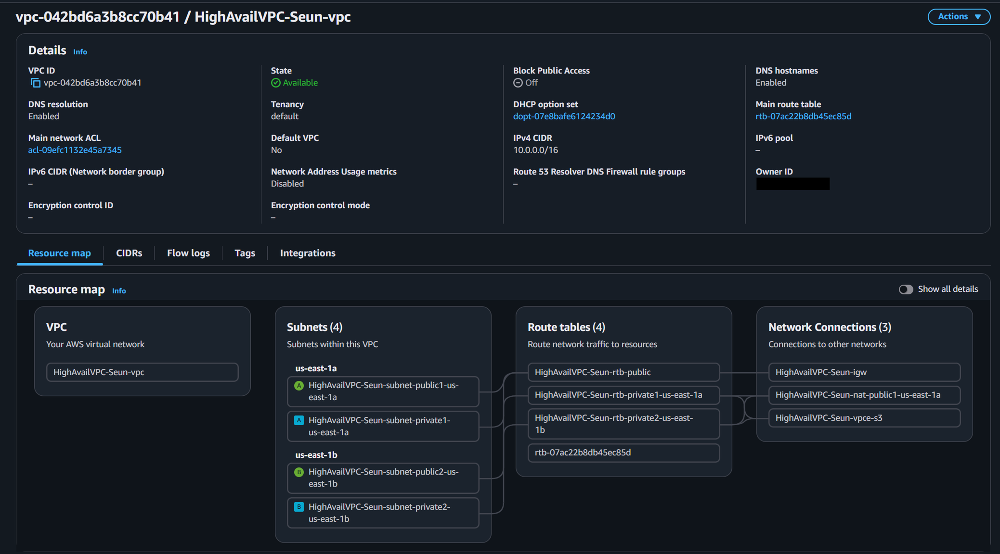

## Step 2: Security group configuration

I created `WebServer Security Group-Seun`, scoped to the new VPC, with two inbound rules: HTTP (port 80) open to `0.0.0.0/0` for web traffic, and SSH (port 22) open to `0.0.0.0/0` for remote access. Outbound traffic was left at the default allow-all.

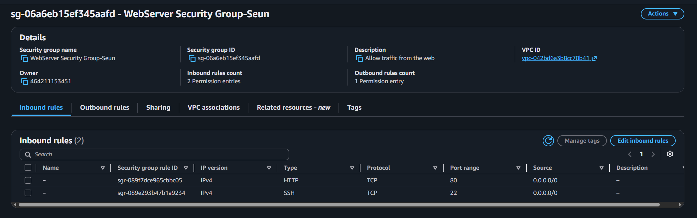

## Step 3: Launch Template creation

I created a launch template, `WebServerTemplate-Seun`, configured with AMI `ami-08f44e8eca9095668`, instance type `t2.micro`, and key pair `MyInstance-Key`, with the security group from Step 2 attached. In the Advanced Details section I added a user data script to install and start Apache, then write a dynamic HTML page showing the instance's hostname.

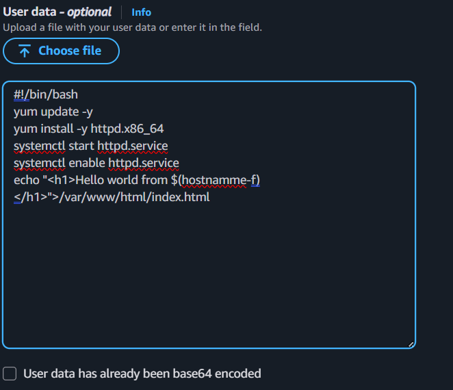

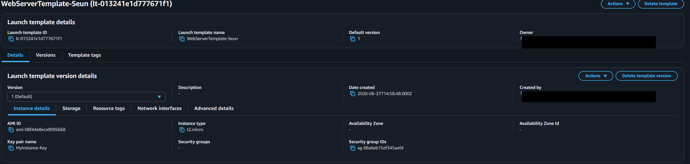

## Step 4: Target group configuration

I created a target group, `WebTargetGroup-Seun`, with target type Instance, protocol HTTP on port 80, protocol version HTTP1. The health check was configured with path `/`, a 30-second interval, 5-second timeout, healthy/unhealthy thresholds of 2, and success code 200. No targets were registered manually — the Auto Scaling Group would register them automatically.

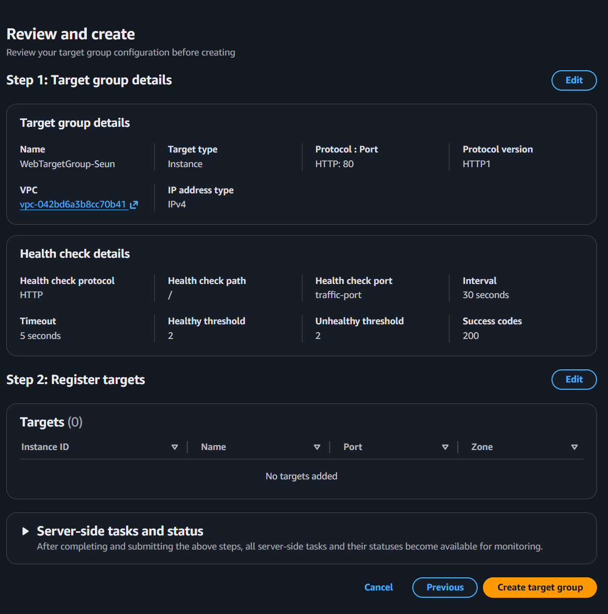

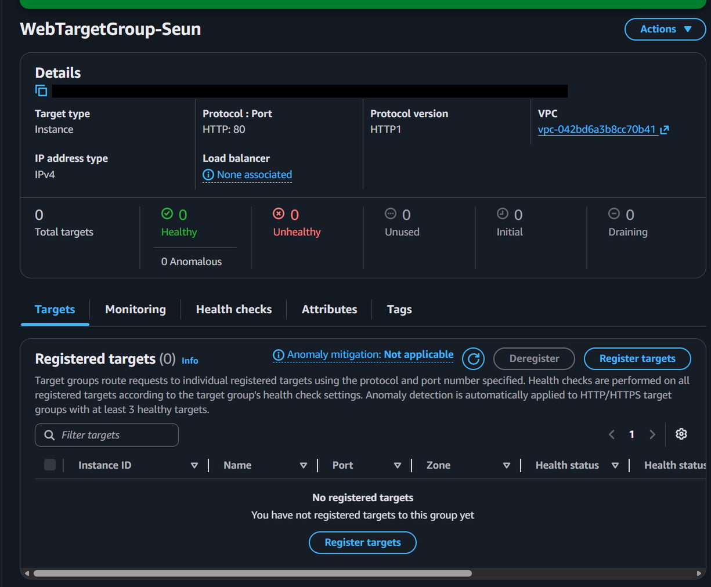

## Step 5: Application Load Balancer creation

I created an internet-facing Application Load Balancer, `WebALB-Seun`, in the new VPC, mapped across both public subnets (`us-east-1a` and `us-east-1b`). Its HTTP:80 listener's default action forwards 100% of traffic to `WebTargetGroup-Seun`.

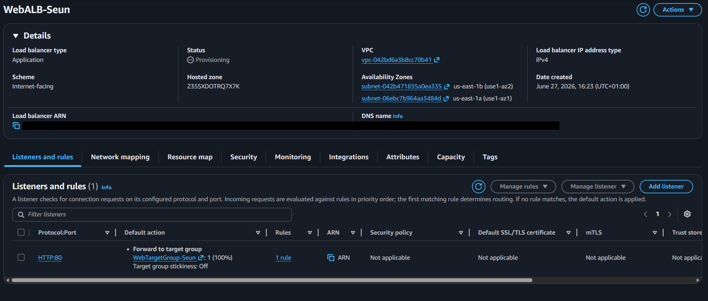

## Step 6: Auto Scaling Group creation

I created an Auto Scaling Group, `WebServerASG-Seun`, using the launch template from Step 3, with desired capacity 3, minimum 2, and maximum 6, spread across both public subnets with a Balanced-best-effort distribution strategy. I attached the ALB's target group and enabled both EC2 and ELB health checks with a 100-second grace period. The group launched 3 instances and reached **At desired capacity**.

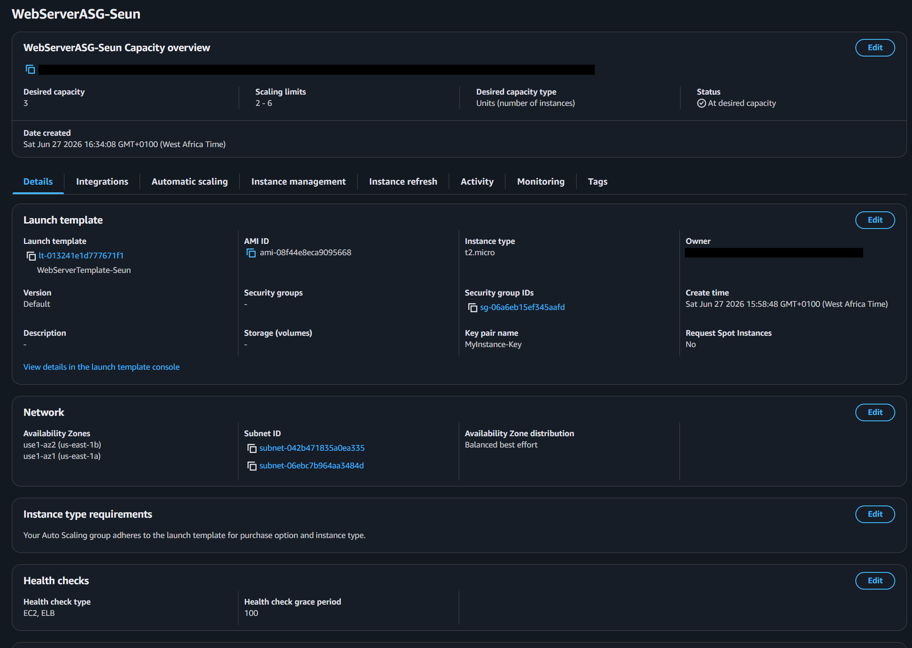

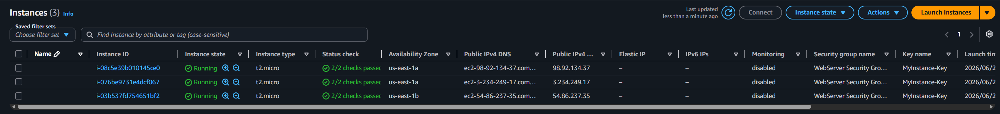

## Step 7: Testing the load balancer and fixing a user data script typo

Pasting the ALB's DNS name into a browser only returned "Hello world from" with no hostname appended — a sign something was wrong with the user data script.


Reviewing the script (Step 3, screenshot above) turned up the bug: the hostname command had been typed as `$(hostnamme-f)` — an extra "m" and a missing space — instead of `$(hostname -f)`. Rather than editing the existing template version in place (launch template versions are immutable once created), I used **Modify template (Create new version)** to define a corrected version 2.

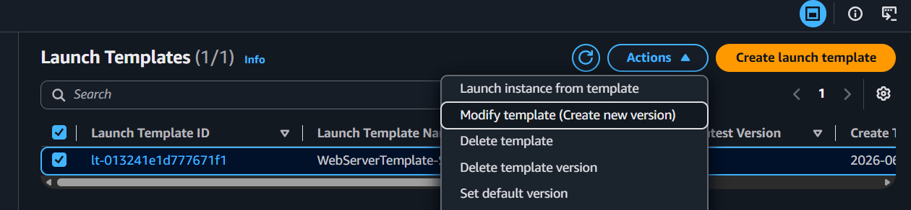

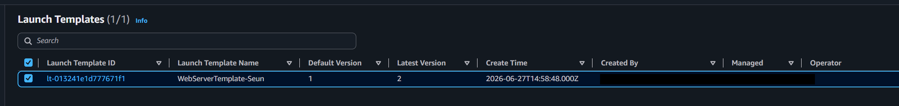

I then edited the Auto Scaling Group to point at the new version.

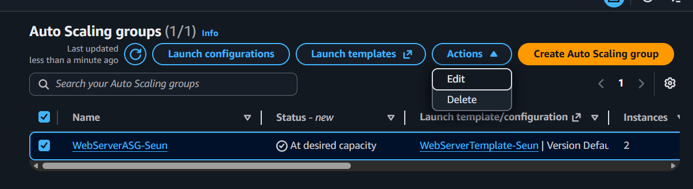

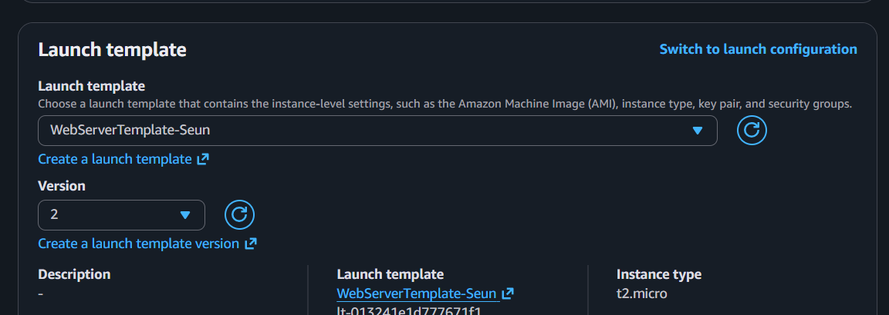

## Step 8: Instance refresh

Simply pointing the ASG at the new launch template version doesn't touch already-running instances — an **Instance Refresh** is needed to actually roll it out. Before starting the refresh, the group's capacity overview showed it running with 2 healthy instances on version 2 (having settled from its original desired capacity of 3 down to 2 by this point).

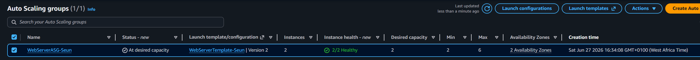

I started an instance refresh using a **Rolling** strategy, with minimum healthy percentage 90%, instance warmup 100 seconds, and Skip matching enabled, so instances already running the correct configuration wouldn't be needlessly replaced.

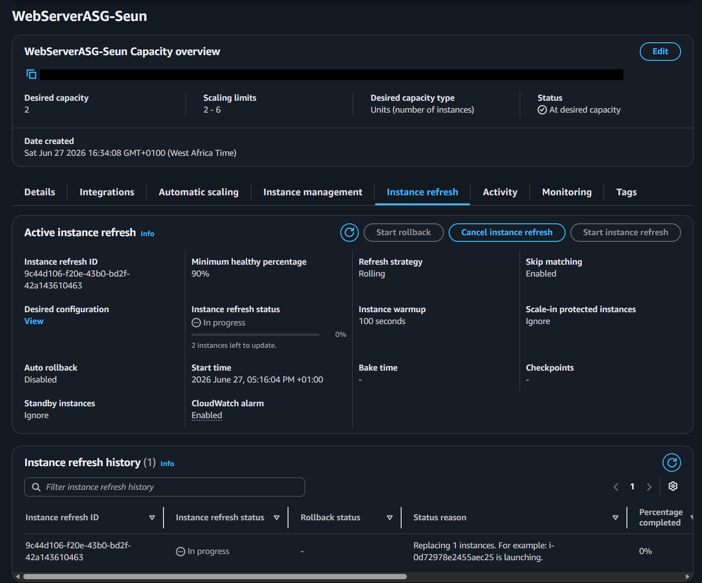

Partway through, the EC2 Instances list showed one instance in a **Terminated** state while the others remained **Running** — the expected rolling replacement in action.

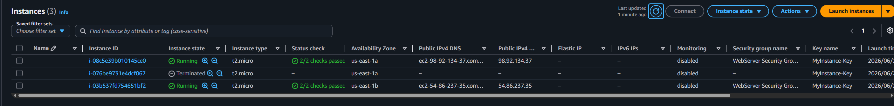

The target group reflected the same transition: 2 healthy targets and 1 draining (the old instance being deregistered).

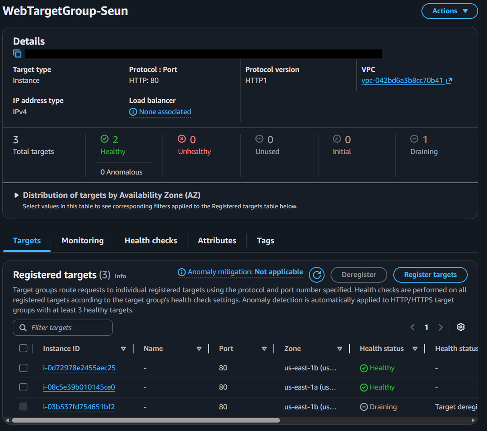

The refresh completed successfully at 100%.

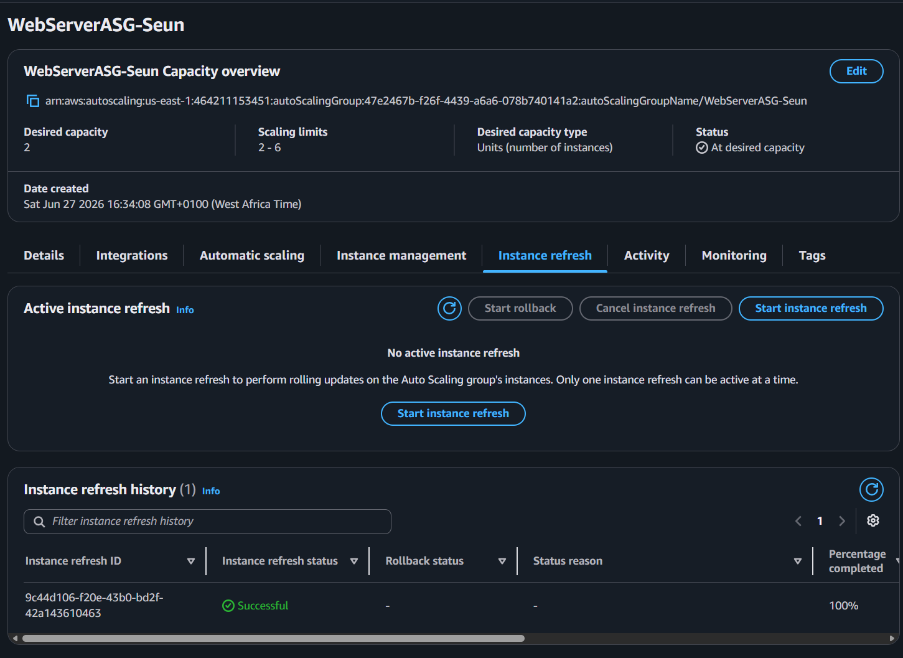

Retesting the ALB's DNS name in the browser now showed the corrected output, with the instance's internal hostname appearing as expected.

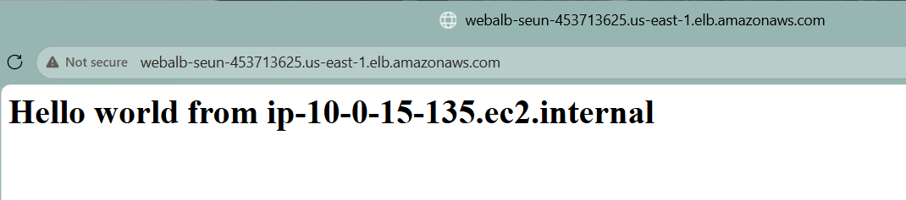

## Step 9: CPU stress test and Auto Scaling validation

To validate the scaling policy end-to-end, I connected to a running instance via EC2 Instance Connect over its public IP.

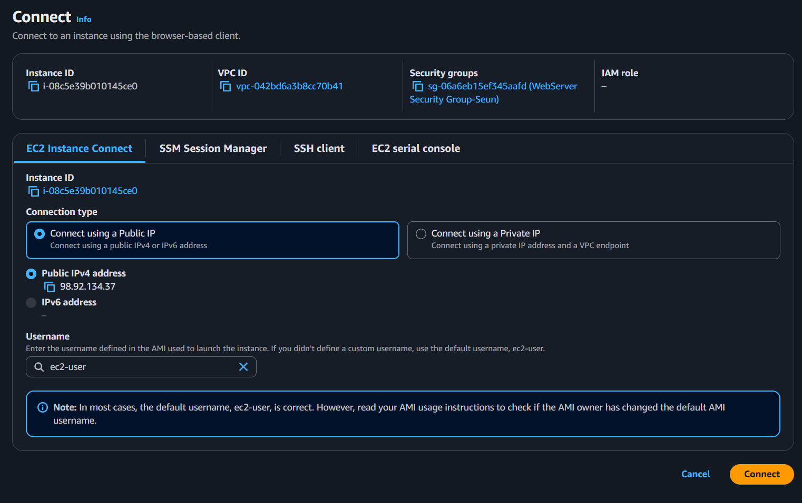

Following the lab instructions, I tried installing the `stress` utility with `sudo amazon-linux-extras install epel -y`, which failed with `command not found`. Checking `/etc/os-release` confirmed the instance was running **Amazon Linux 2023**, not Amazon Linux 2 — AL2023 replaced `amazon-linux-extras` with `dnf` and doesn't ship the `epel-release` package in its default repositories, so `sudo dnf install -y epel-release` failed too (`No match for argument: epel-release`).

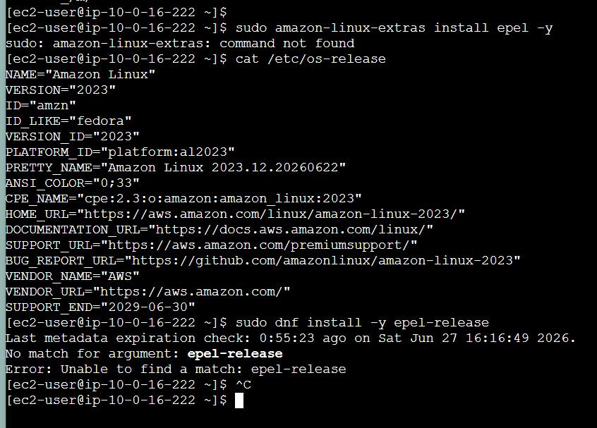

The fix was to skip EPEL entirely and install `stress` directly from the AL2023 `amazonlinux` repository:

```bash
sudo dnf install -y stress
```

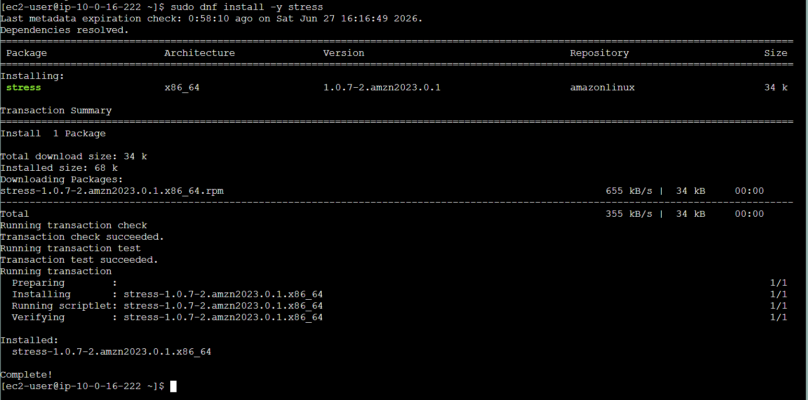

I then ran the stress test itself, using 2 CPU workers for a 600-second timeout:

```bash
stress --cpu 2 --timeout 600
```

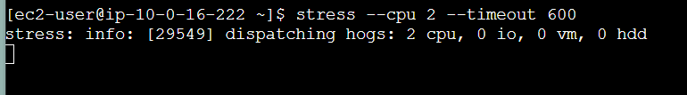

CloudWatch collects CPU metrics on a 5-minute default interval, so there's a lag between the CPU spike and the scaling alarm firing. Checking the EC2 Instances list during this window showed the fleet had scaled out well beyond its starting size — one capture caught 6 running instances at once, matching the Auto Scaling Group's configured maximum.

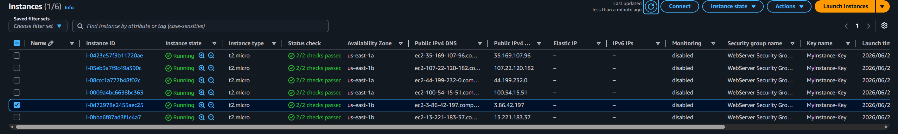

By the time the 600-second stress timeout elapsed and CPU usage returned to normal, the group had already begun scaling back in: the instances list settled at 3 running and 2 terminated, with the Auto Scaling Group's Activity tab confirming both the scale-out and scale-in events by timestamp — the scaling policy worked correctly even though the live transition wasn't caught screenshot-by-screenshot.

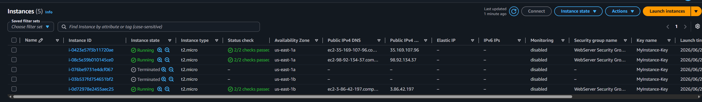

## Key concepts

| Concept | Description |
|---|---|
| Launch template versioning | Existing launch template versions are immutable; fixing a bug in user data requires creating a *new version*, not editing the existing one, then pointing consumers (the ASG) at it. |
| Instance Refresh | Rolling replacement of an ASG's running instances so they pick up a new launch template version, without needing to manually terminate instances one by one. |
| Minimum healthy percentage & Skip matching | Controls how much capacity an instance refresh can take offline at once, and whether instances already matching the target configuration are left alone. |
| Health check grace period | Gives newly launched instances time to finish booting before health checks can mark them unhealthy — critical during a refresh, when replacement instances are still warming up. |
| Amazon Linux 2 vs. Amazon Linux 2023 | AL2023 replaced `amazon-linux-extras` with `dnf` as the package manager and dropped default access to the EPEL repository — commands and packages written for AL2 (like installing `stress` via EPEL) don't carry over automatically. |
| CloudWatch metric granularity | Default CPU metrics are collected on a 5-minute interval, so there's a real delay between a load spike and an Auto Scaling alarm reacting to it — scaling activity should be confirmed via the Activity tab's timestamps, not assumed from what's visible live. |
| Scale-out then scale-in | An ASG scaling policy isn't one-directional — once the triggering condition (high CPU) clears, the group scales back toward its desired capacity, terminating the instances it no longer needs. |

## What I learned

This lab tied together everything from the main HA lab (VPC, ALB, target groups, ASG) with two things that only show up once you actually operate the infrastructure: fixing a live configuration bug, and proving the scaling policy under real load. Finding the user data typo by reading the actual served output — rather than assuming the script was correct because it looked right — was a good reminder that "Hello world from" with nothing after it is itself useful diagnostic information.

Rolling out the fix taught me that launch templates aren't editable in place; the correct pattern is a new version plus an Instance Refresh, which is designed specifically to replace instances gradually while keeping the application available throughout — I could see this directly in the target group's mix of Healthy and Draining targets mid-refresh.

The CPU stress test surfaced a genuinely useful troubleshooting moment: the lab's documented command for installing `stress` assumed Amazon Linux 2's `amazon-linux-extras` tool, but the instance was running Amazon Linux 2023, which uses `dnf` and doesn't include EPEL by default. Confirming the OS version with `/etc/os-release` before troubleshooting further, rather than assuming the lab instructions were simply wrong, was the right instinct — the fix (installing `stress` directly via `dnf` from the AL2023 repository) took one command once the actual cause was clear. Finally, watching the instance count balloon toward the ASG's configured maximum and then settle back down after the stress test ended was a concrete demonstration that the scaling policy responds in both directions, not just by adding capacity.
