# AWS IAM — Users, Groups, Policies & S3 Permission Testing

**Programme:** Cloudboosta CBA Training Programme — Feb Cohort 1 (Cloud Engineering track)
**Topic:** AWS Identity and Access Management (IAM)
**Environment:** AWS Management Console

## Objective

Set up IAM users and groups for a team of ten employees, write custom IAM policies with different S3 permission scopes, and then test those policies against real S3 actions using three dedicated test users. The goal was to go beyond just creating identities and policies and actually confirm, user by user and action by action, what each policy did and didn't allow.

## Skills demonstrated

- Creating IAM users and IAM groups, and attaching policies at the group level
- Mapping job roles to least-privilege AWS managed policies
- Writing custom IAM policies in raw JSON
- Attaching customer-managed policies to individual users for controlled testing
- Verifying permissions by signing in as the identity being tested, not just reading the policy
- Interpreting AWS console "Access denied" / "Insufficient permissions" errors and tracing them back to the missing IAM action
- Setting a billing safeguard (budget alert) independent of IAM permissions

## Task 1: IAM users and groups

I created one IAM user per employee (`Lola_Adisa`, `Taiwo_Ibrahim`, `Ryan_Tracy`, `Toyin_Williams`, `Astrid_Rowley`, `Anike_Jolaoso`, `Hammed_Lee`, `Ridwan_Ishola`, `Akshay_Pardeep`, `Kingsley_Omotoso`).

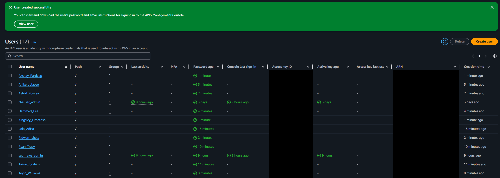

I then created thrree user groups, each carrying the permissions their role needed:  `DevOps`, `Software`, and `SysAdmin`.

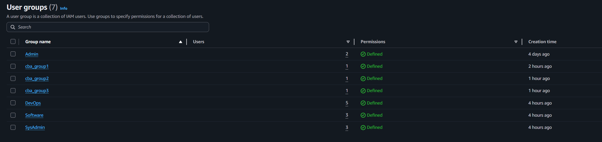

I added each employee to the group matching their role and attached the corresponding AWS managed policy to that group, then confirmed the policy worked for each one:

| Employee Name | IAM User Created | IAM Group | IAM Policy Attached | Policy Worked? |
|---|---|---|---|---|
| Lola Adisa | Lola_Adisa | DevOps | IAMFullAccess | Yes |
| Taiwo Ibrahim | Taiwo_Ibrahim | Software | AmazonS3FullAccess | Yes |
| Ryan Tracy | Ryan_Tracy | Software | AmazonS3FullAccess | Yes |
| Toyin Williams | Toyin_Williams | Software | AmazonS3FullAccess | Yes |
| Astrid Rowley | Astrid_Rowley | DevOps | IAMFullAccess | Yes |
| Anike Jolaoso | Anike_Jolaoso | SysAdmin | DatabaseAdministrator | Yes |
| Hammad Lee | Hammed_Lee | SysAdmin | DatabaseAdministrator | Yes |
| Ridwan Ishola | Ridwan_Ishola | DevOps | IAMFullAccess | Yes |
| Akshay Pardeep | Akshay_Pardeep | DevOps | IAMFullAccess | Yes |
| Kingsley Omotoso | Kingsley_Omotoso | SysAdmin | DatabaseAdministrator | Yes |


To sanity-check the setup, I signed in as `cbauser_admin` and opened the Console Home dashboard. The Cost and usage widget (current month, cost breakdown, forecasted month end) returned **Access denied** — confirming that the attached IAM policy grants IAM/service-level access but not billing/Cost Explorer access, which is scoped separately.

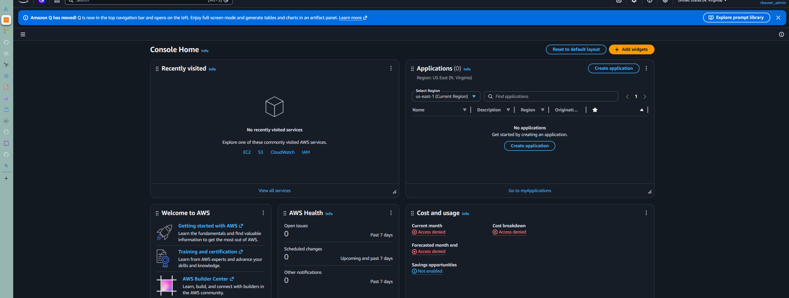

As a safeguard while running the rest of the IAM and S3 tests in the account, I created a monthly budget (`Monthly Cost Alert`) with a $10 threshold.

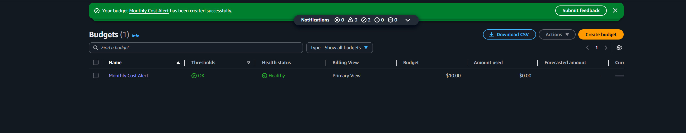

## Task 2: Custom IAM policies

I wrote three custom IAM policies in raw JSON, each with a progressively narrower S3 scope, so I'd have a clean set of test cases for Task 3.

**`iam_policy_1`** — full S3 access:

```json
{
  "Version": "2012-10-17",
  "Statement": [
    {
      "Sid": "Statement1",
      "Effect": "Allow",
      "Action": "s3:*",
      "Resource": "arn:aws:s3:::*"
    }
  ]
}
```

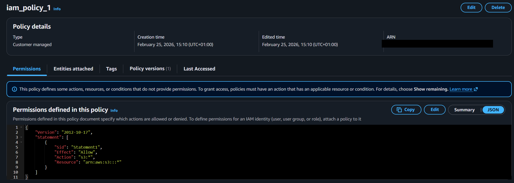

**`iam_policy_2`** — partial admin access (delete a bucket, read an object, list all buckets):

```json
{
  "Version": "2012-10-17",
  "Statement": [
    {
      "Sid": "Statement1",
      "Effect": "Allow",
      "Action": [
        "s3:DeleteBucket",
        "s3:GetObject",
        "s3:ListAllMyBuckets"
      ],
      "Resource": "arn:aws:s3:::*"
    }
  ]
}
```

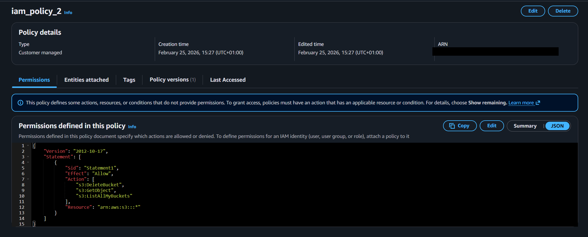

**`iam_policy_3`** — read-only bucket listing:

```json
{
  "Version": "2012-10-17",
  "Statement": [
    {
      "Sid": "Statement1",
      "Effect": "Allow",
      "Action": [
        "s3:ListBucket"
      ],
      "Resource": "arn:aws:s3:::*"
    }
  ]
}
```

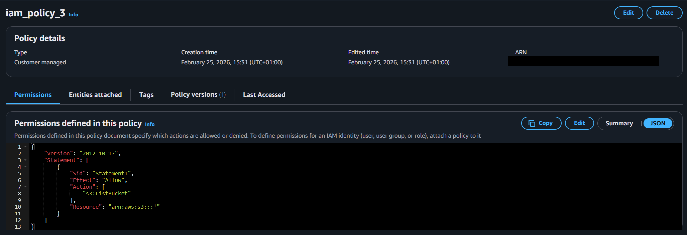

All three attached without error, though the console flagged `iam_policy_1` and `iam_policy_2` with: *"This policy defines some actions, resources, or conditions that do not provide permissions."* I didn't dismiss this — I carried it into Task 3 and tested whether it actually mattered in practice. I confirmed both policies existed by filtering the account's 1,452 policies down to the 3 I'd created.

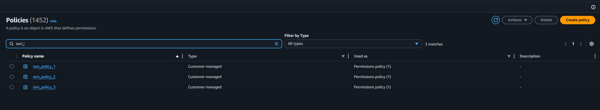

## Task 3: Testing the policies against S3

I created three dedicated test users — `cbauser_4`, `cbauser_5`, `cbauser_6` — and attached `iam_policy_1`, `iam_policy_2`, and `iam_policy_3` to them respectively, so I could test each policy through the actual AWS console rather than just trusting the JSON.

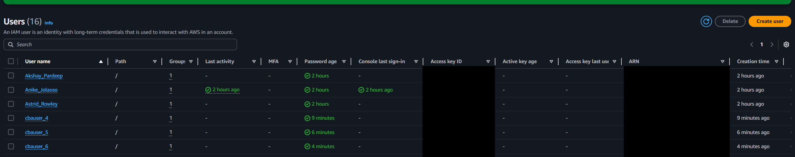

**`cbauser_4` (`iam_policy_1`, full S3 access):** created both `amzn-cba-store-1` and `amzn-cba-store-2`.

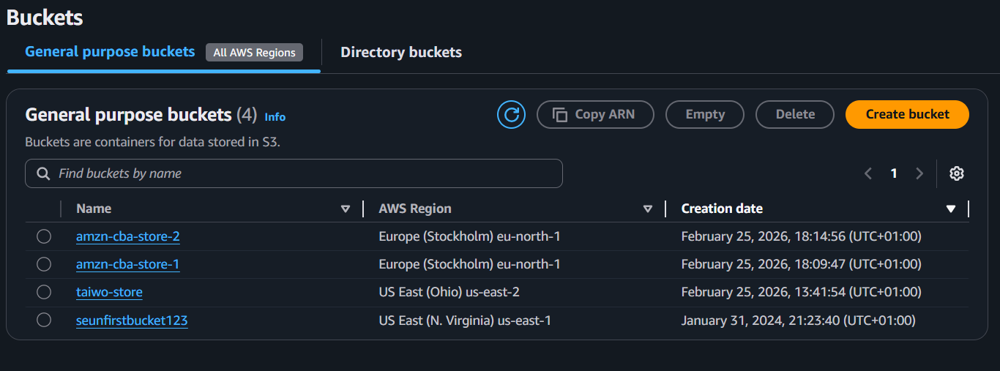

I then uploaded three test files (`STEPHEN PEMI.pdf`, `EKE JOY.pdf`, `IMG-20260113-WA0002.jpg`) to `amzn-cba-store-1` to test `PutObject`, and downloaded one back to test `GetObject` — both succeeded.

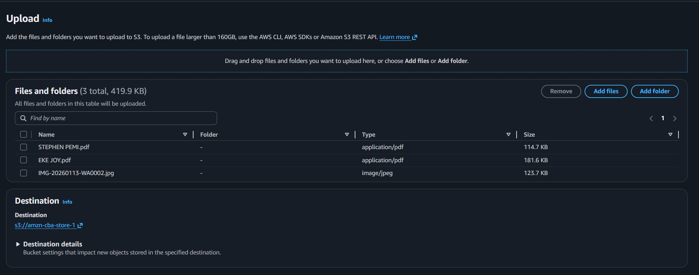
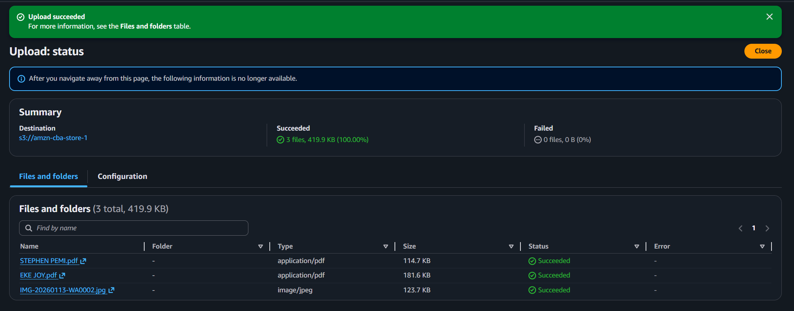
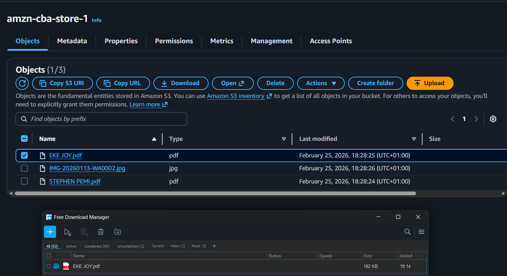

**`cbauser_5` (`iam_policy_2`):** because the policy includes `s3:ListAllMyBuckets`, `cbauser_5` could see all 4 buckets in the account.

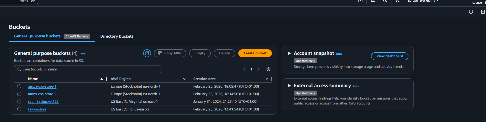

`iam_policy_2` also includes `s3:DeleteBucket`, so I deleted `taiwo-store` to confirm — it worked.

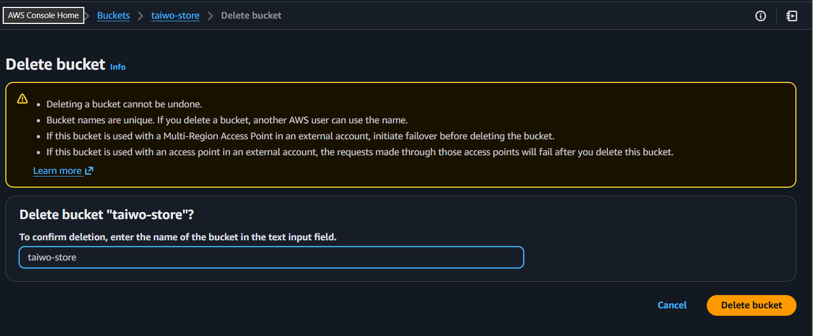
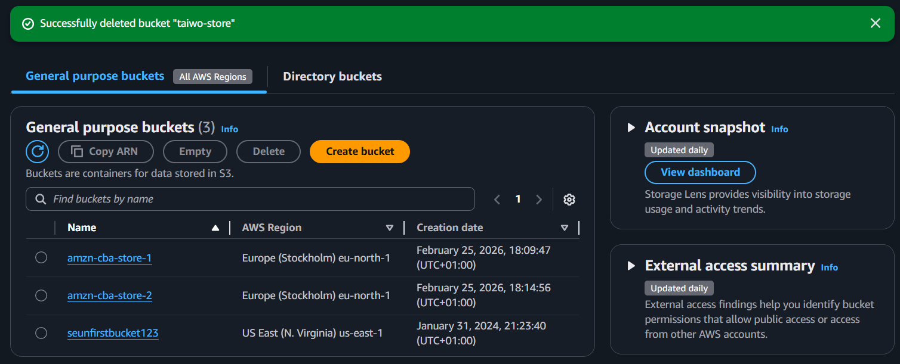

Trying to create a new bucket as `cbauser_5` failed, exactly as expected since `s3:CreateBucket` isn't in the policy:

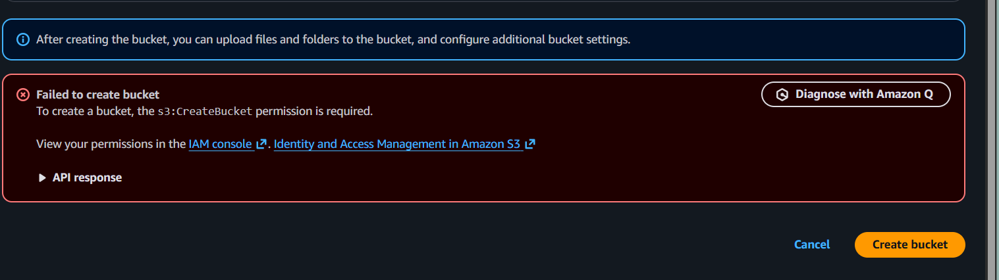

The more interesting result: even though `s3:GetObject` is listed in `iam_policy_2`, opening `amzn-cba-store-1`'s Objects tab returned "Insufficient permissions to list objects," asking for `s3:ListBucket`. Because `ListBucket` wasn't in the policy, the console couldn't render the object list at all — so there was no way to reach an object and actually exercise the `GetObject` grant. This is exactly the scenario the console's earlier warning was hinting at: a listed action that doesn't function in practice without a supporting permission.

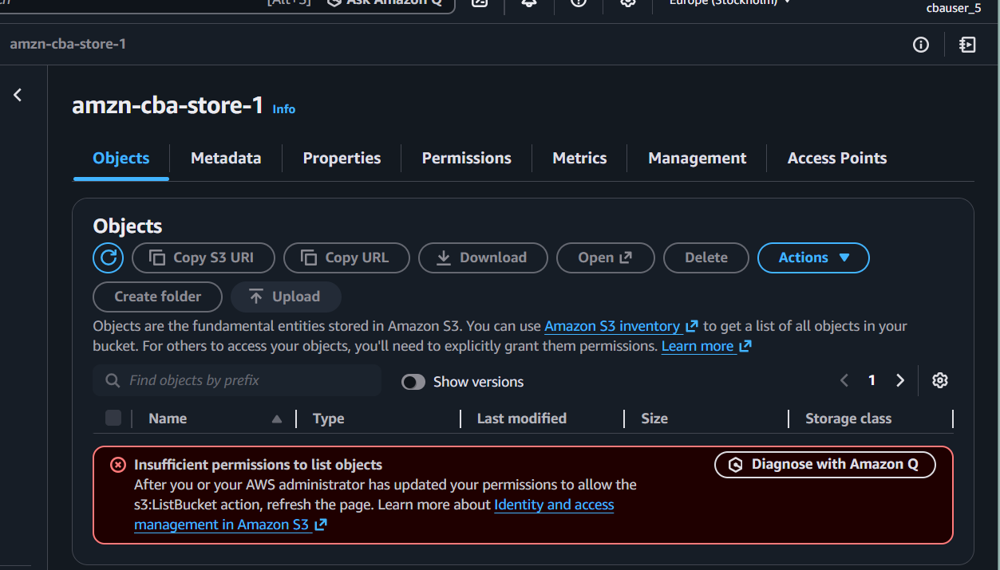

**`cbauser_6` (`iam_policy_3`, `s3:ListBucket` only):** opening the S3 Buckets page returned "You don't have permissions to list buckets," asking for `s3:ListAllMyBuckets` — a different, and here missing, action from `s3:ListBucket`. With only `ListBucket` granted, `cbauser_6` also had no path to create a bucket.

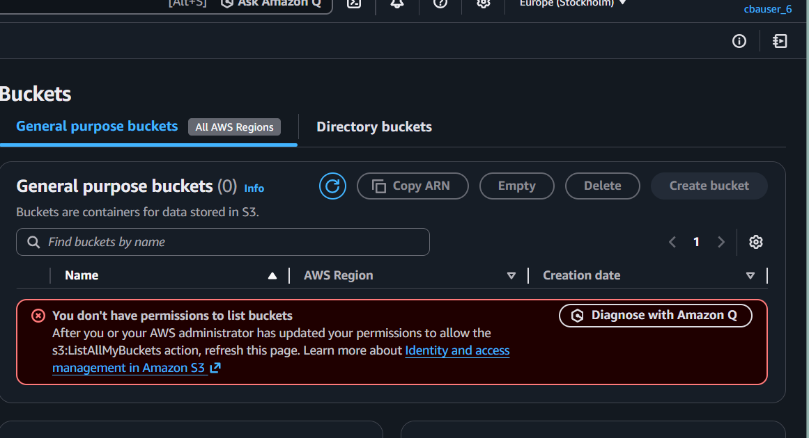

### Results summary

| Action tested | User | Policy | Action required | Result |
|---|---|---|---|---|
| Create bucket | cbauser_4 | iam_policy_1 (`s3:*`) | `s3:CreateBucket` | Allowed |
| Upload object (PutObject) | cbauser_4 | iam_policy_1 | `s3:PutObject` | Allowed |
| Download object (GetObject) | cbauser_4 | iam_policy_1 | `s3:GetObject` | Allowed |
| List all buckets | cbauser_5 | iam_policy_2 | `s3:ListAllMyBuckets` | Allowed |
| Delete bucket (`taiwo-store`) | cbauser_5 | iam_policy_2 | `s3:DeleteBucket` | Allowed |
| Create bucket | cbauser_5 | iam_policy_2 | `s3:CreateBucket` | Denied |
| Get object | cbauser_5 | iam_policy_2 | `s3:GetObject` (needs `s3:ListBucket` to reach it via console) | Denied |
| List all buckets | cbauser_6 | iam_policy_3 | `s3:ListAllMyBuckets` | Denied |
| Create bucket | cbauser_6 | iam_policy_3 | `s3:CreateBucket` | Denied |

## Key concepts

| Concept | Description |
|---|---|
| IAM user | An identity with long-term credentials for signing in to AWS or making programmatic calls. |
| IAM group | A collection of users; policies attached to a group apply to every member, avoiding per-user policy management. |
| Managed policy | A standalone, reusable AWS-authored (or customer-authored) policy that can be attached to multiple users, groups, or roles. |
| Least privilege | Granting only the permissions required for a role — reflected here by mapping DevOps → IAMFullAccess, Software → AmazonS3FullAccess, SysAdmin → DatabaseAdministrator. |
| `s3:ListAllMyBuckets` | Bucket-level action controlling whether a user can see the list of buckets in the account. |
| `s3:ListBucket` | Bucket-level action (despite the name) controlling whether a user can list the *objects inside* a specific bucket. |
| `s3:GetObject` / `s3:PutObject` | Object-level actions that operate on objects, not the bucket itself. |
| `s3:CreateBucket` / `s3:DeleteBucket` | Bucket-level actions, independent of object-level permissions. |
| Billing/Cost Explorer access | Separate from service-level IAM permissions; a user can have full IAM or S3 access and still be denied cost data. |
| Console policy validation | The IAM console statically checks policy documents and warns when it can't confirm every action has a matching, effective resource — worth testing, not just reading. |

## What I learned

Reading a policy's JSON only tells you what should happen — testing each action as the actual assigned user is what confirms it. The clearest example was `cbauser_5`: `iam_policy_2` explicitly lists `s3:GetObject`, but without `s3:ListBucket` the console never rendered an object to click on, so that permission was effectively unreachable through the UI. That taught me S3 permissions are split across several narrowly scoped actions — list buckets vs. list objects vs. get/put an object vs. create/delete a bucket — and a policy needs the *supporting* actions, not just the target one, for a workflow to actually work end to end. I also confirmed that managing permissions at the group level made the Task 1 setup far easier to audit than attaching policies per user would have been, and that broad service access (like `IAMFullAccess`) still doesn't imply billing visibility — a useful safety boundary to know is there in a real organization.
