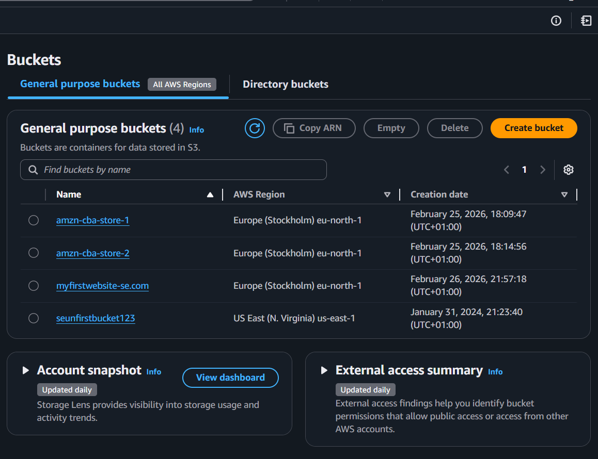
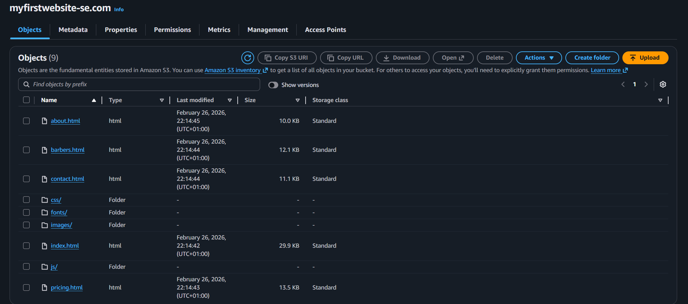
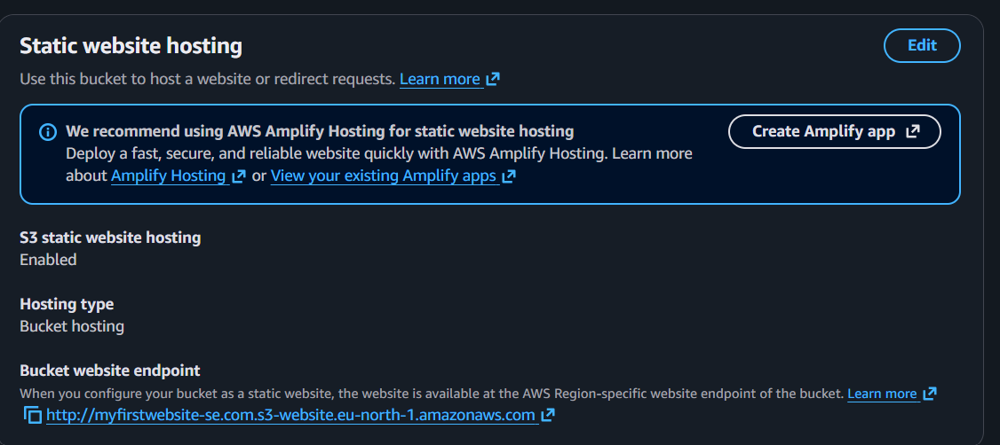
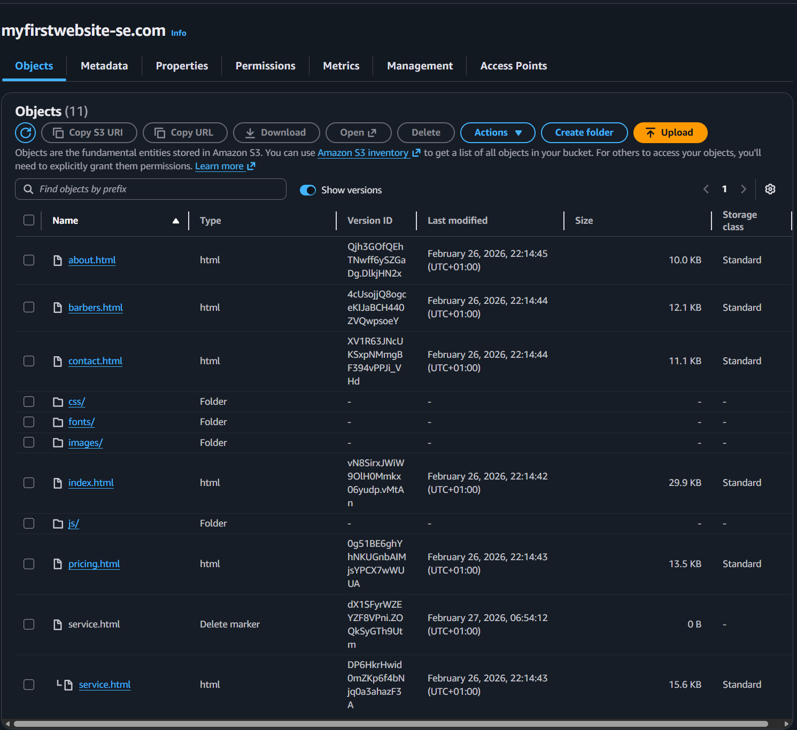

# AWS S3 — Bucket Creation, Static Website Hosting & Versioning

**Programme:** Cloudboosta CBA Training Programme — Feb Cohort 1 (Cloud Engineering track)
**Topic:** Amazon S3 — bucket creation, static website hosting, versioning and lifecycle management
**Environment:** AWS Management Console

## Objective

Create an S3 bucket, upload a small static website to it, host it directly from S3, then turn on versioning and observe how S3 handles a deleted object once versioning is enabled.

## Skills demonstrated

- Creating an S3 bucket with a DNS-friendly name for website hosting
- Uploading files and folders into a bucket
- Enabling static website hosting on a bucket and locating its endpoint
- Enabling object versioning
- Understanding delete markers and how "deleting" an object behaves differently once versioning is on

## Task 1: Create the bucket and upload the site files

I created a bucket named `myfirstwebsite-se.com` in `eu-north-1` (Stockholm), alongside the buckets from the IAM exercises.



I uploaded the site (six HTML files — `index.html`, `service.html`, `pricing.html`, `contact.html`, `barbers.html`, `about.html` — plus `css/`, `fonts/`, and `images/` folders) and confirmed all 9 objects landed in the bucket.



## Task 2: Enable static website hosting

In the bucket's Properties tab, I enabled static website hosting (bucket hosting type) and noted the generated website endpoint:

```
http://myfirstwebsite-se.com.s3-website.eu-north-1.amazonaws.com
```



Visiting that endpoint served the site directly from the bucket — no EC2 instance or web server involved.


## Task 3: Versioning and lifecycle behavior

I turned on versioning for the bucket, then deleted `service.html` and switched on "Show versions" to see what actually happened. Rather than removing the object outright, S3 inserted a **delete marker** as the new current version — the original `service.html` version is still there underneath it, just hidden from normal (non-versioned) requests.



## Key concepts

| Concept | Description |
|---|---|
| Bucket naming for website hosting | Using a DNS-style bucket name (`myfirstwebsite-se.com`) makes the S3 website endpoint map cleanly to the intended domain. |
| S3 static website hosting | Serves HTML/CSS/JS directly from a bucket via a region-specific endpoint — no compute layer required, but no HTTPS by default. |
| Versioning | Once enabled, every write to an object creates a new version instead of overwriting it, and every "delete" is non-destructive by default. |
| Delete marker | A zero-byte placeholder S3 creates as the new "current" version when you delete an object in a versioned bucket — the prior version(s) remain in the bucket and can be restored. |

## What I learned

The most interesting result was in the versioning task — I expected "delete" to actually remove `service.html`, but with versioning on, S3 just stacks a delete marker on top and keeps the real object underneath. That's a meaningfully different (and safer) default than un-versioned S3 behavior, and it's the kind of thing you only really internalize by deleting something and then going to look for it.
