# Linux Fundamentals

**Programme:** Cloudboosta CBA Training Programme — Feb Cohort 1  
**Topic:** Linux Fundamentals — Filesystem Navigation, File Management & System Monitoring  
**Environment:** Ubuntu via WSL (Windows Subsystem for Linux)

---

## Objective

This section covers two Linux exercises I completed during the cloud engineering phase of the bootcamp. The lab introduced me to core Linux skills required for working in cloud and DevOps environments — navigating the filesystem, managing files and directories, and monitoring system resources. The assignment then reinforced those skills through a set of practical file operation tasks.

---

## Skills Demonstrated

- Navigating the Linux filesystem and displaying directory contents
- Viewing hidden files and folders
- Creating nested directory structures
- Creating, copying, moving, appending, and deleting files
- Redirecting command output into files
- Checking disk space, memory availability, and CPU information
- Monitoring system performance

---

## Lab Tasks

### 1. List Files and Folders

I listed files and folders in my Ubuntu environment and confirmed the current working directory running on my Windows PC via WSL.

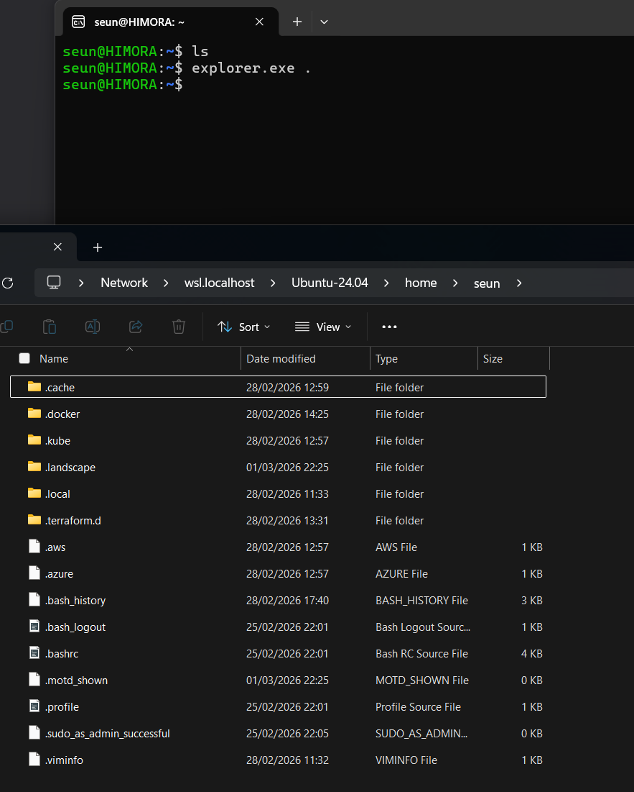

---

### 2. View Hidden Files and Folders

I used the `ls -a` flag to reveal hidden files and folders (those prefixed with `.`) that are not visible with a standard `ls` command.

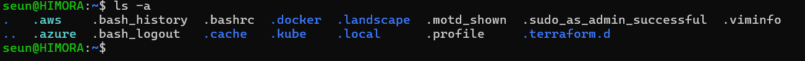

---

### 3. Create Directory Structure

I created a parent folder named `cloudboosta_linux` and then created multiple subdirectories inside it, including a folder structure containing an `Asia` directory among others representing continents.


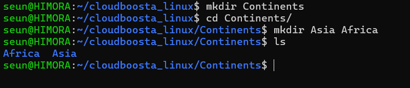

---

### 4. Navigate and View Directory Contents

I navigated into the `Asia` folder and listed its contents to confirm the directory structure had been created correctly.

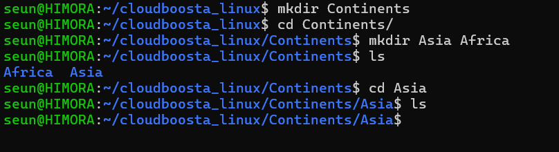

---

### 5. Create Files in the Continents Directory

I created files inside the Continents directory to practise file creation within a nested folder structure.

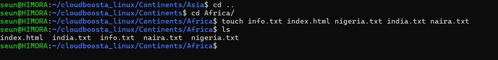

---

### 6. Copy, Move, Create and Delete Files and Folders

I practised the full range of file management operations — creating new files, copying content between files, moving files to new locations, and deleting files and folders.

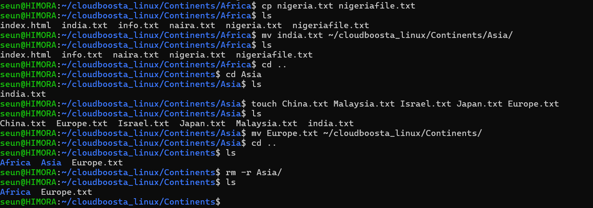

---

### 7. Check Disk Space Usage

I used the `df` command to check disk space usage across mounted filesystems.

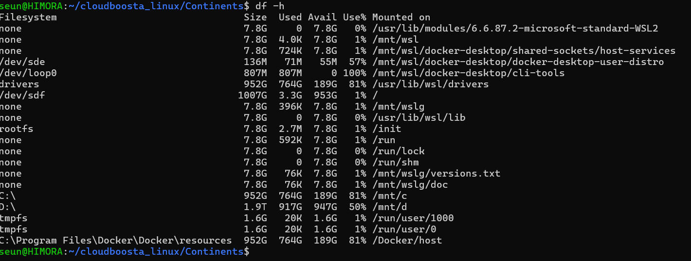

---

### 8. Monitor System Performance

I used the `vmstat` command to report on virtual memory usage, CPU activity, 
I/O statistics and system interrupts — giving an overall picture of how the 
system was performing at a low level.

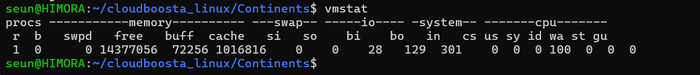

---

### 9. Check Available Memory

I used the `free` command to display available and used memory on the system.

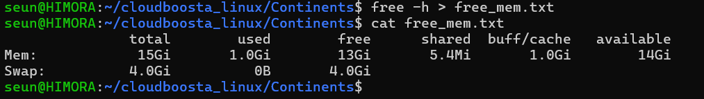

---

## Assignment Tasks

### 1. Create Folder and Files

I created a folder named `Assignment` containing three text files: `sample1.txt`, `sample2.txt`, and `sample3.txt`.

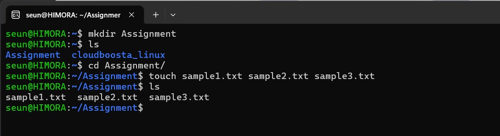

---

### 2. Append Files into a New File

I appended the contents of all three sample files into a new file named `title.txt` using output redirection.

```bash
cat sample1.txt sample2.txt sample3.txt >> title.txt
```

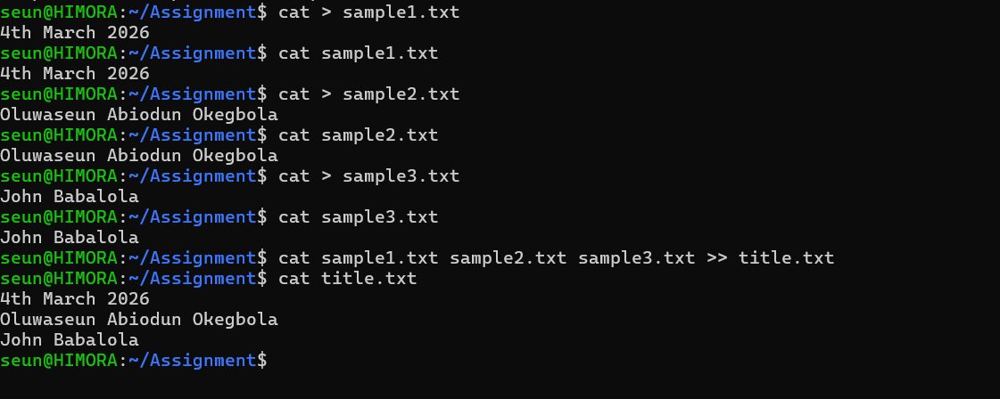

---

### 3. Copy Content and Move File

I copied the content of `sample2.txt` into a new file named `my_name.txt`, then moved it into a newly created folder called `Names`.

```bash
cp sample2.txt my_name.txt
mkdir Names
mv my_name.txt Names/
```

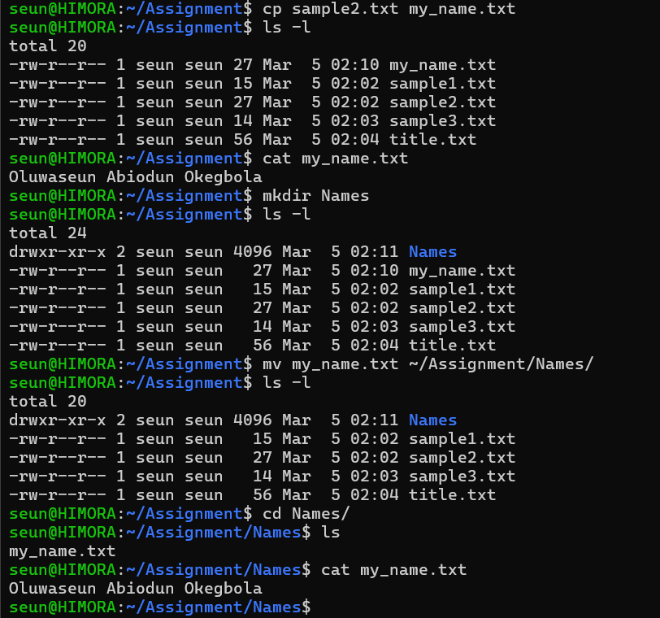

---

### 4. Save Command Output to a File

I saved the output of the `free` command into a file named `system.txt` using output redirection.

```bash
free > system.txt
```

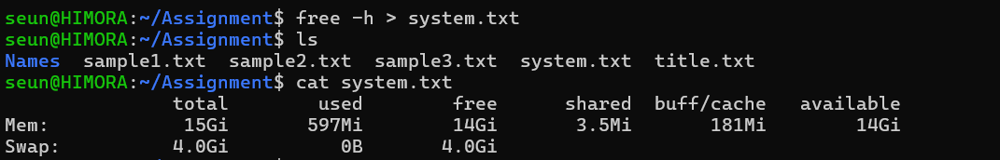

I then appended the results of `lscpu` to the same file.

```bash
lscpu >> system.txt
```

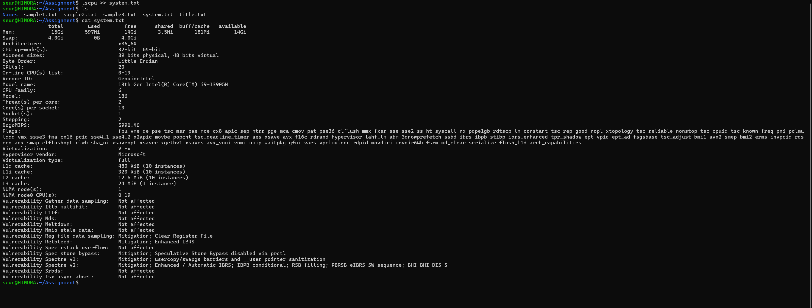

---

### 5. Redirect Echo Output

I used the `echo` command with output redirection to write a specified string into a file named `weather.txt`.

```bash
echo "The weather is nice" > weather.txt
```

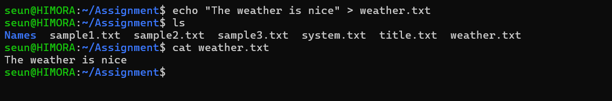

---

### 6. Create File and Determine File Type

I created a file named `sample5.txt` and used the `file` command to determine its type. The result confirmed the file type as **Text**.

```bash
touch sample5.txt
file sample5.txt
```

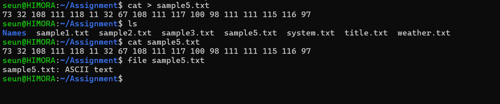

---

## Key Commands Reference

| Command | Purpose |
|---------|---------|
| `ls` | List files and folders |
| `ls -la` | List all files including hidden, with details |
| `pwd` | Print current working directory |
| `mkdir` | Create a directory |
| `mkdir -p` | Create nested directories in one command |
| `touch` | Create an empty file |
| `cp` | Copy a file |
| `mv` | Move or rename a file |
| `rm` | Delete a file |
| `cat` | Display file contents |
| `>>` | Append output to a file |
| `>` | Redirect output to a file (overwrites) |
| `echo` | Print text to terminal or file |
| `file` | Determine the type of a file |
| `df -h` | Check disk space usage (human readable) |
| `free -m` | Check available memory in megabytes |
| `lscpu` | Display CPU architecture information |
| `vmstat` | Report virtual memory, CPU, I/O and system interrupt statistics |
---

## What I Learned

Working through these exercises made clear to me how central the Linux command line is to cloud and DevOps work. Every tool I went on to use later in the bootcamp — Docker, Kubernetes, Jenkins, the AWS CLI — is operated from the terminal, so being comfortable with filesystem navigation, file management, and output redirection is foundational. The assignment reinforced that these aren't just academic exercises; piping and redirecting command output into files is exactly how log collection and system monitoring scripts are built in real environments.
