# Python Fundamentals

**Programme:** Cloudboosta CBA Training Programme — Feb Cohort 1  
**Topic:** Python Fundamentals — Variables, Strings, Lists, and Dictionaries  
**Environment:** VS Code connected to Ubuntu via WSL

---

## Objective

This section covers two Python exercises I completed during the cloud engineering phase of the bootcamp. The lab introduced me to core Python concepts including strings, variables, data types, f-strings, and user input. The assignment then extended those skills into working with lists, list slicing, string methods, and dictionaries.

---

## Skills Demonstrated

- Setting up a Python development environment in VS Code via WSL
- Working with multi-line strings and variables
- Performing numerical operations with variables
- Using f-strings to format output
- Checking data types with `type()`
- Accepting user input at runtime
- Using escape characters to format strings
- Creating and slicing lists
- Using built-in string and list methods
- Working with dictionaries — adding, removing, and querying key-value pairs

---

## Lab Tasks

### 1. Environment Setup

I set up VS Code for Python by connecting to Ubuntu via WSL and creating a new folder to store my Python files.

**Steps I followed:**

1. Installed the **WSL extension** in VS Code 
2. Opened the WSL terminal and navigated to my home directory
3. Created a new folder for my Python work:
   ```bash
   mkdir Python-lab
   cd Python-lab
   ```
4. Opened the folder in VS Code directly from WSL:
   ```bash
   code .
   ```
5. Installed the **Python extension** in VS Code 
6. Created a new file `lab1.py` and confirmed VS Code detected the Python interpreter from WSL

VS Code connected seamlessly to the Ubuntu environment via WSL, meaning all code ran on Linux while I worked in the VS Code GUI on Windows.

---

### 2. Multi-line Strings

I wrote a program using a triple-quoted multi-line string to print personal information across several lines.

```python
#print("Hello World")

print(''' My name is Seun.
      I am 4 years old.
      I enjoy drawing.
      I currently work at a Nigerian Federal Government Office.
      I come from Oyo state.
      I currently live in Nigeria.''')
```

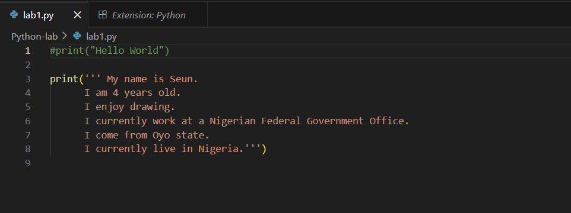

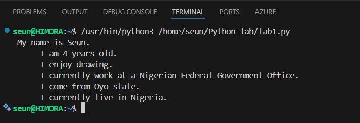

---

### 3. Variables

I rewrote the same program using variables instead of a hard-coded string, assigning each piece of information to a named variable and printing them all.

```python
name = "Seun"
age = 4
hobby = "drawing"
job = "I currently work at a Nigerian Federal Government Office."
state_of_origin = "Oyo state"
current_residence = "Nigeria"

print(name, "\n", age, "\n", hobby, "\n", job, "\n", state_of_origin, "\n", current_residence)
```

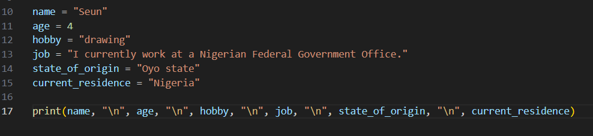

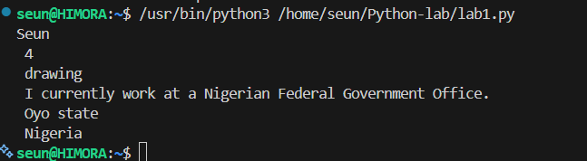

---

### 4. Numerical Variables

I executed arithmetic operations using numerical variables, including addition, subtraction, integer conversion, float conversion, and modulo.

```python
sum1 = 8 + 13
sub = 20 - 6
int_conversion = int(6.99)
float_conversion = float(8)
y = 100 % 19

print(sum1, sub, int_conversion, float_conversion, y)
```

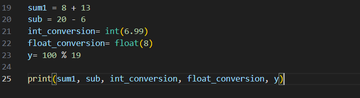

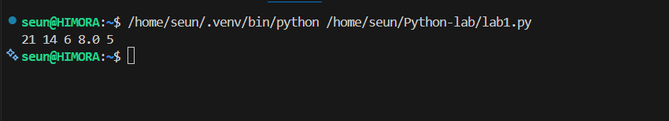

---

### 5. F-strings

I applied f-strings to format the personal information variables into a single readable output. I commented out the previous blocks of code to isolate this task.

```python
print(f"My name is {name}. \nI am {age} years old. \nI enjoy {hobby}. \n{job} \nI come from {state_of_origin}. \nI currently live in {current_residence}.")
```

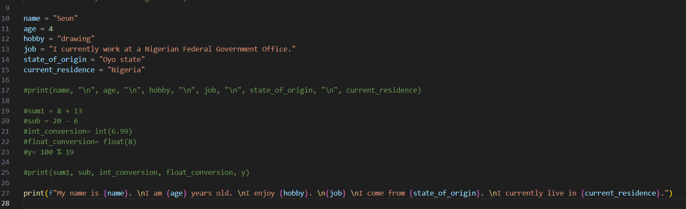

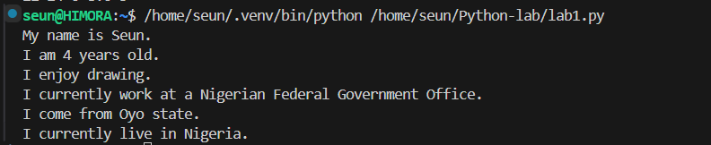

---

### 6. Variable Types

I used the `type()` function to check and display the data type of each variable — confirming string, integer, and float types.

```python
name = "Seun"
print(type(name))
age = 4
print(type(age))
dem = 3.14
print(type(dem))
```

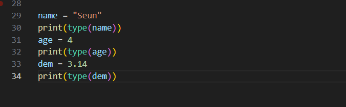

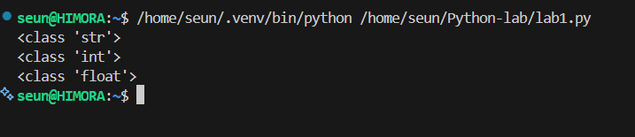

---

### 7. User Input

I wrote a Python program that prompts the user to enter their name and age at runtime, then prints a formatted response using an f-string.

```python
name = input("What is your name? ")
age = input("What is your age? ")

print(f"Hello, {name}, you are {age} years old")
```

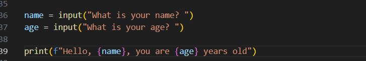

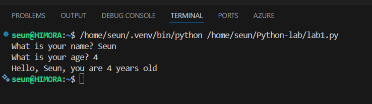

---

### 8. Escape Characters

I used the `\n` escape character within a single print statement to break a sentence across three lines.

```python
print("Hello world. \nWelcome to cloudboosta. \nLet's keep learning")
```

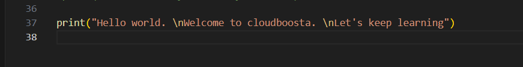

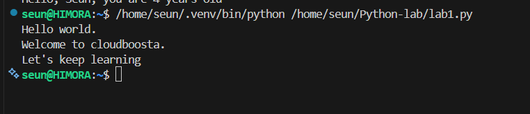

---

## Assignment Tasks

### 1. Create Lists and Slice Cars

I created four lists in Python covering car brands, random numbers, music artists, and Cloudboosta cohort members. I then sliced the cars list to extract the 2nd to 4th items using `cars[1:4]`.

```python
cars = ["Toyota", "Honda", "BMW", "Mercedes", "Lexus", "Audi"]
nums = [10, 15, 30, 24, 55, 16, 37, 48, 29, 110, 75, 90, 60, 45, 80]
musicians = ["J Cole", "Drake", "Eminem", "Eve", "Rhema", "Davido", "Wizkid"]
Cohort_members = ["John", "Ayobami", "Salima", "Emmanuel", "Wisdom", "Adeyinka", "Bamidele", "Osahon", "Olorunife", "Akinwunmi"]

list_slice = cars[1:4]
print(list_slice)
```

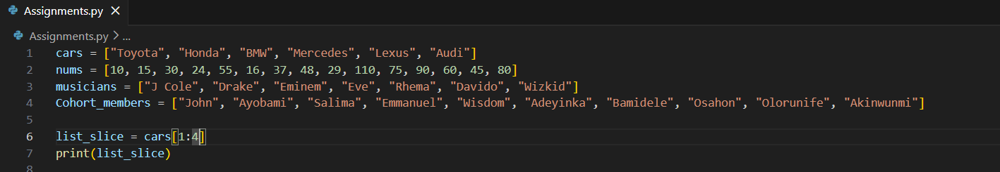

![Slice cars output — ['Honda', 'BMW', 'Mercedes']](screenshots/14b-slice-cars-output.png)

---

### 2. Slice Numbers

I sliced the numbers list to extract the 3rd to 11th items using `nums[2:11]`.

```python
list_slice = nums[2:11]
print(list_slice)
```

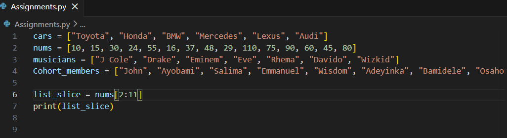

![Slice numbers output — [30, 24, 55, 16, 37, 48, 29, 110, 75]](screenshots/15b-slice-numbers-output.png)

---

### 3. Slice Artists

I sliced the musicians list to extract the 4th to 5th items using `musicians[3:5]`.

```python
list_slice = musicians[3:5]
print(list_slice)
```

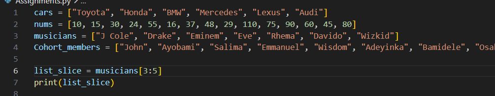

![Slice artists output — ['Drake', 'Eminem', 'Eve', 'Rhema']](screenshots/16b-slice-artists-output.png)

---

### 4. Count Apples in a List

I created a fruits list and used the `.count()` method to find how many times `"apple"` appeared. The result was 3.

```python
fruits = ["banana", "apple", "guava", "pear", "apple", "orange", "mango", "apple", "banana"]
print(fruits.count("apple"))
```

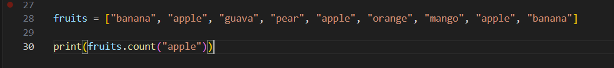

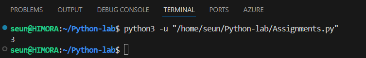

---

### 5. Capitalise All Letters

I used `str.upper()` to convert the entire word `pseudopseudohypoparathyroidism` to uppercase.

```python
capitals = "pseudopseudohypoparathyroidism"
print(str.upper(capitals))
```

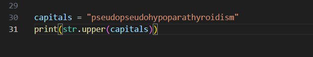

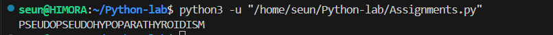

---

### 6. Check if Letters are Lowercase

I used `str.islower()` to verify whether all characters in the word `happy` are in lowercase. The result was `True`.

```python
check = 'happy'
print(str.islower(check))
```

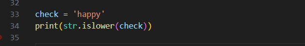

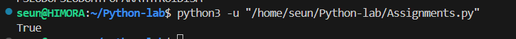

---

### 7. Check Membership in a List

I used the `in` operator to check if `"orange"` existed in the fruits list. Previous tasks were commented out to isolate this check. The result was `True`.

```python
print("orange" in fruits)
```

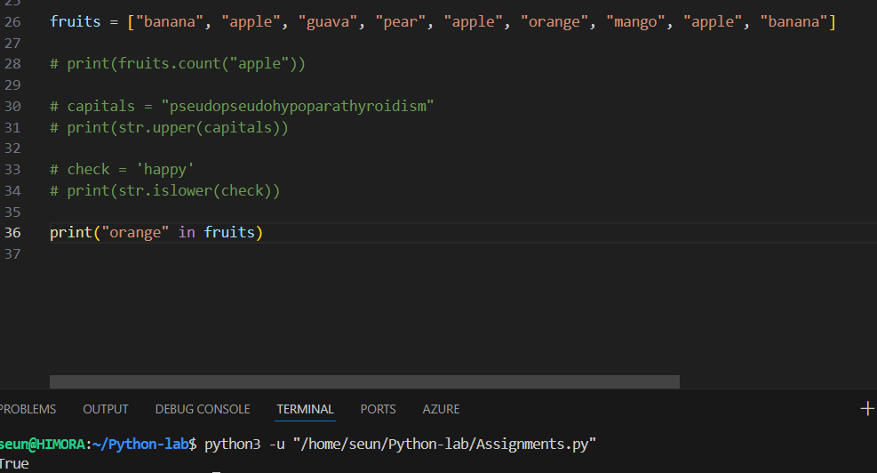

---

### 8. Dictionaries

I created a dictionary of students as key-value pairs and performed four operations on it.

```python
student_list = {
    "student1": "Bola",
    "student2": "Godson",
    "student3": "Azeez",
    "student4": "Amaka",
    "student5": "Zainab",
}
```

**Print all keys:**

```python
print(student_list.keys())
# Output: dict_keys(['student1', 'student2', 'student3', 'student4', 'student5'])
```

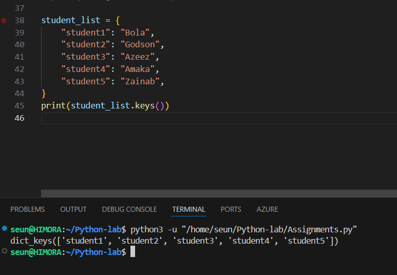

---

**Remove student3:**

I used `.pop()` to remove `student3` (Azeez) from the dictionary and printed the updated dictionary to confirm.

```python
print(student_list.pop("student3"))
print(student_list)
# Output: Azeez
# {'student1': 'Bola', 'student2': 'Godson', 'student4': 'Amaka', 'student5': 'Zainab'}
```

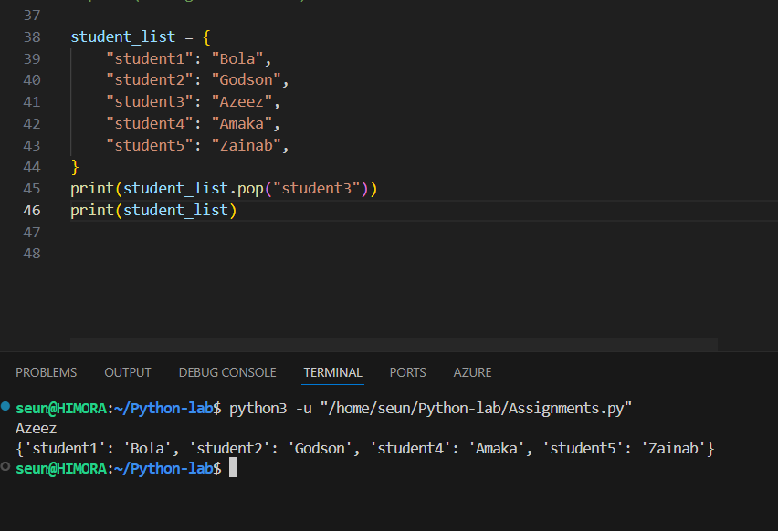

---

**Add student6:**

I used `.update()` to add a new student, Ahmed, as `student6` and printed the updated dictionary.

```python
student_list.update({"student6": "Ahmed"})
print(student_list)
# Output: {'student1': 'Bola', 'student2': 'Godson', 'student4': 'Amaka', 'student5': 'Zainab', 'student6': 'Ahmed'}
```

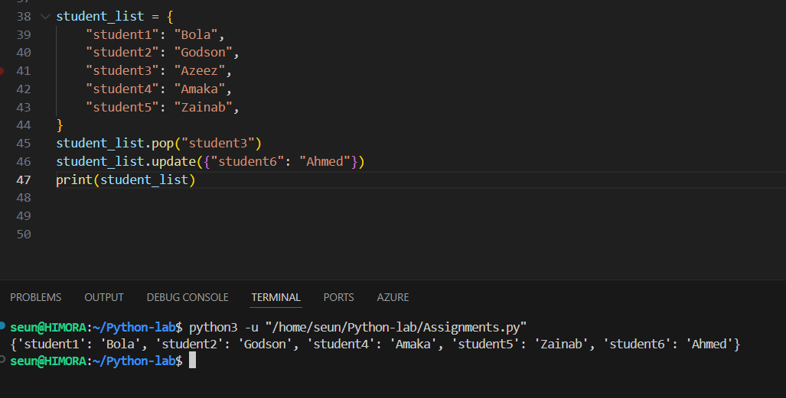

---

**Get value of student2:**

I used `.get()` to retrieve the value associated with the key `student2`. The result was `Godson`.

```python
print(student_list.get("student2"))
# Output: Godson
```

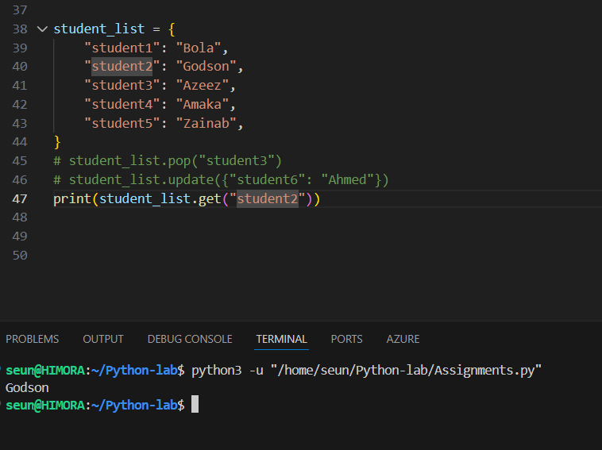

---

## Key Concepts Reference

| Concept | Example |
|---------|---------|
| Multi-line string | `'''line one \nline two'''` |
| Variables | `name = "Seun"` |
| Arithmetic | `sum1 = 8 + 13` |
| Type conversion | `int(6.99)`, `float(8)` |
| Modulo | `100 % 19` |
| f-string | `f"Hello {name}"` |
| Check type | `type(variable)` |
| User input | `input("Enter value: ")` |
| Escape newline | `\n` |
| List slicing | `list[1:4]` |
| Count in list | `list.count("item")` |
| Uppercase string | `str.upper("text")` |
| Check lowercase | `str.islower("text")` |
| Check membership | `"item" in list` |
| Dictionary keys | `dict.keys()` |
| Remove from dict | `dict.pop("key")` |
| Update dict | `dict.update({"key": "value"})` |
| Get dict value | `dict.get("key")` |

---

## What I Learned

These exercises gave me a solid grounding in Python fundamentals that directly supports my cloud and DevOps work. Writing Lambda functions in later labs required exactly the skills practised here that is variables, f-strings, and working with data structures. The assignment in particular made me comfortable with lists and dictionaries. 